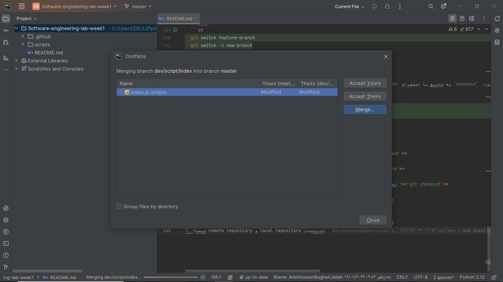
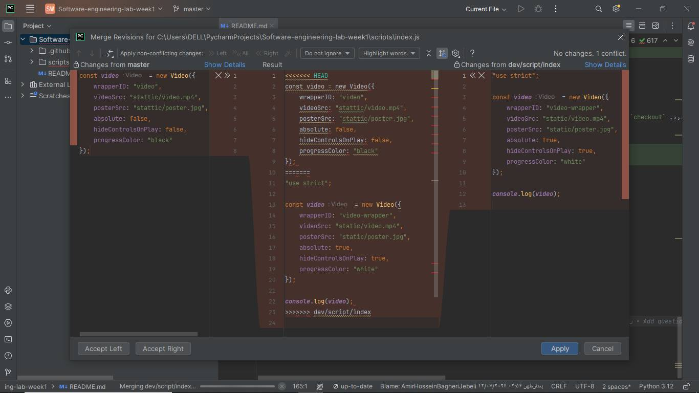

# Software-engineering-lab-week1
hi

## پرسش‌ها
علاوه بر گزارش آزمایش، پاسخ سوالات زیر را هم داخل فایل README بنویسید:
1. پوشهٔ `.git` چیست؟ چه اطلاعاتی در آن ذخیره می‌شود؟ با چه دستوری ساخته می‌شود؟

پوشهٔ `.git` یک دایرکتوری مخفی در سیستم‌های کنترل نسخهٔ Git است که حاوی تمامی اطلاعات مورد نیاز برای ردیابی و مدیریت تاریخچهٔ تغییرات پروژه است. این پوشه شامل تمامی فراداده‌ها و اطلاعات مربوط به مخزن است.

### اطلاعات ذخیره شده در پوشهٔ `.git`
**شاخه‌ها (Branches)**: اطلاعات شاخه‌های مختلف پروژه در فایل‌های موجود در دایرکتوری `refs/heads` ذخیره می‌شود.
**برچسب‌ها (Tags)**: برچسب‌های مختلف پروژه در دایرکتوری `refs/tags` ذخیره می‌شوند.
**اشیاء (Objects)**: تمام کامیت‌‌ها، درخت‌ها (trees)، و اشیاء blob (فایل‌ها) در دایرکتوری `objects` ذخیره می‌شوند.
**سرنخ‌ها (Heads)**: سرنخ‌های فعلی در فایل `HEAD` قرار دارد.
**پیکربندی (Configuration)**: تنظیمات محلی مخزن در فایل `config` ذخیره می‌شود.
**شاخص‌ها (Index)**: شاخص‌های staging area در فایل `index` قرار می‌گیرد.
**ورودی‌های بازنگری (Logs)**: سوابق تغییرات در فایل‌های `logs` ثبت می‌شود.

### دستور ساخت پوشهٔ `.git`
پوشهٔ `.git` به طور خودکار هنگام ایجاد یک مخزن جدید Git ایجاد می‌شود. برای ایجاد یک مخزن جدید Git و به تبع آن پوشهٔ `.git`، از دستور زیر استفاده می‌شود:

```sh
git init
```

این دستور، پوشهٔ `.git` را در دایرکتوری فعلی ایجاد و آن را به یک مخزن Git تبدیل می‌کند.

2. منظور از atomic بودن در atomic commit و atomic pull-request چیست؟

مفهوم "atomic" در زمینهٔ تولید و توسعهٔ نرم‌افزار و سامانه‌های کنترل نسخه به معنای «غیرقابل تقسیم» و «واحد کامل» است. در این مفهوم، یک عملیات atomic به‌گونه‌ای انجام می‌شود که یا به‌طور کامل انجام می‌شود یا اصلاً انجام نمی‌شود، بدون وجود هیچ حالت میانی‌ای.

### Atomic Commit
در Git، یک "atomic commit" به معنای یک commit است که یک واحد تغییرات مستقل و کامل را اعمال می‌کند. این بدان معنی است که:

**کامل بودن**: تمام تغییرات مرتبط با یک ویژگی یا باگ در یک commit گنجانده شده است.
**عدم شکستگی**: اگر commit انجام شود، تمامی تغییرات به صورت یکجا اعمال می‌شوند؛ در غیر این صورت، هیچ‌کدام از تغییرات اعمال نمی‌شود.
**قابلیت بازگشت**: به‌راحتی می‌توان این commit را به حالت قبلی برگرداند (revert) بدون نگرانی از به هم ریختن پروژه.

### Atomic Pull-Request
یک "atomic pull-request" در سیستم‌های کنترل نسخه مانند GitHub یا GitLab به معنای یک pull request است که شامل یک مجموعهٔ کامل و مستقل از تغییرات است. این تغییرات باید به‌گونه‌ای باشند که:

**کامل بودن**: تمام کد، تست‌ها، و مستندات مربوط به یک ویژگی یا باگ در این pull request گنجانده شده باشد.
**مستقل بودن**: این pull request نباید وابسته به تغییرات دیگری باشد و باید بتواند به‌طور مستقل merge شود.
**قابلیت تست**: این pull request باید به راحتی قابل تست و بررسی باشد، چون شامل تغییرات مرتبط و جامع است.

3. تفاوت دستورهای fetch و pull و merge و rebase و cherry-pick را بیان کنید.

در Git، دستورهای `fetch`، `pull`، `merge`، `rebase` و `cherry-pick` هر کدام عملکرد خاصی دارند و برای مدیریت تغییرات و همگام‌سازی مخازن استفاده می‌شوند. در ادامه تفاوت‌ها و کاربردهای هر یک از این دستورها بیان می‌شود:

### `git fetch`
- **کاربرد**: دانلود تغییرات از مخزن راه دور (remote) بدون ادغام آنها با شاخه فعلی.
- **توضیح**: این دستور تمامی شاخه‌ها و تغییرات موجود در مخزن راه دور را به مخزن محلی شما می‌آورد، اما تغییرات را در شاخه فعلی شما اعمال نمی‌کند. تغییرات در شاخه‌های مخفی به نام `origin/branch_name` ذخیره می‌شوند.
- **مثال**:
  ```sh
  git fetch origin
  ```

### `git pull`
- **کاربرد**: دانلود و ادغام تغییرات از مخزن راه دور با شاخه فعلی.
- **توضیح**: این دستور ترکیبی از `fetch` و `merge` است. ابتدا تغییرات از مخزن راه دور دانلود می‌شود و سپس به صورت خودکار با شاخه فعلی شما ادغام می‌شود.
- **مثال**:
  ```sh
  git pull origin main
  ```

### `git merge`
- **کاربرد**: ادغام شاخه‌های مختلف در مخزن محلی.
- **توضیح**: این دستور تغییرات از یک شاخه را با شاخه فعلی شما ادغام می‌کند. نتیجهٔ این ادغام معمولاً یک commit جدید به نام merge commit است که تاریخچهٔ تغییرات هر دو شاخه را نگهداری می‌کند.
- **مثال**:
  ```sh
  git merge feature-branch
  ```

### `git rebase`
- **کاربرد**: تغییر پایهٔ شاخه فعلی به شاخه دیگر.
- **توضیح**: این دستور تمام کامیت‌های شاخه فعلی را می‌گیرد و آنها را بر اساس شاخه هدف دوباره اعمال می‌کند. نتیجه این است که تاریخچه تغییرات خطی‌تر و تمیزتر به نظر می‌رسد. با استفاده از `rebase` می‌توان از merge کامیت‌های اضافی اجتناب کرد.
- **مثال**:
  ```sh
  git rebase main
  ```

### `git cherry-pick`
- **کاربرد**: اعمال کامیت‌های خاص از یک شاخه به شاخه فعلی.
- **توضیح**: این دستور یک یا چند commit خاص را از یک شاخه دیگر گرفته و آنها را به شاخه فعلی شما اعمال می‌کند. این ابزار مفید است وقتی که نیاز دارید فقط تغییرات خاصی را از یک شاخه دیگر اعمال کنید.
- **مثال**:
  ```sh
  git cherry-pick abc123
  ```

### خلاصه
- **`git fetch`**: دانلود تغییرات از remote بدون ادغام.
- **`git pull`**: دانلود و ادغام تغییرات از remote.
- **`git merge`**: ادغام تغییرات یک شاخه با شاخه فعلی.
- **`git rebase`**: تغییر پایهٔ شاخه فعلی به شاخه دیگر و دوباره اعمال کردن کامیت‌ها.
- **`git cherry-pick`**: اعمال کامیت‌های خاص از یک شاخه دیگر به شاخه فعلی.

استفاده از هر کدام از این دستورها بستگی به نیاز و شرایط خاص پروژه و تیم شما دارد.

4. تفاوت دستورهای reset و revert و restore و switch و checkout را بیان کنید.

دستورات `reset`، `revert`, `restore`, `switch`, و `checkout` در Git هر کدام برای مدیریت تغییرات و شاخه‌ها به کار می‌روند و هر یک کاربردها و مفاهیم خاص خود را دارند. در ادامه تفاوت‌ها و کاربردهای هر یک از این دستورات بیان می‌شود:

### `git reset`
- **کاربرد**: تغییر موقعیت شاخه فعلی و برگشت دادن تغییرات در شاخه.
- **توضیح**: این دستور به سه حالت مختلف عمل می‌کند: `--soft`, `--mixed`, و `--hard`. 
  - `--soft`: تنها موقعیت شاخه را تغییر می‌دهد و تغییرات در staging area باقی می‌مانند.
  - `--mixed` (حالت پیش‌فرض): موقعیت شاخه را تغییر می‌دهد و تغییرات staging area را برمی‌گرداند اما تغییرات در فایل‌های کاری باقی می‌مانند.
  - `--hard`: موقعیت شاخه را تغییر می‌دهد، تغییرات staging area را برمی‌گرداند و تغییرات فایل‌های کاری را نیز برمی‌گرداند.
- **مثال**:
  ```sh
  git reset --soft HEAD~1
  git reset --mixed HEAD~1
  git reset --hard HEAD~1
  ```

### `git revert`
- **کاربرد**: ایجاد یک commit جدید که تغییرات یک commit قبلی را برمی‌گرداند.
- **توضیح**: این دستور برای بازگرداندن اثرات یک commit خاص بدون تغییر تاریخچه استفاده می‌شود. این کار با ایجاد یک commit جدید که معکوس تغییرات commit مورد نظر است انجام می‌شود.
- **مثال**:
  ```sh
  git revert abc123
  ```

### `git restore`
- **کاربرد**: بازگرداندن فایل‌ها از repository به حالت قبلی.
- **توضیح**: این دستور برای بازگرداندن فایل‌های کاری و staging area به وضعیت قبلی استفاده می‌شود. دو حالت اصلی دارد:
  - `--source`: مشخص کردن منبع بازگردانی.
  - `--staged`: بازگرداندن فایل‌ها از staging area.
- **مثال**:
  ```sh
  git restore --source=HEAD --staged <file>
  git restore <file>
  ```

### `git switch`
- **کاربرد**: تغییر شاخه (branch).
- **توضیح**: این دستور برای جابجایی بین شاخه‌ها استفاده می‌شود. همچنین می‌توان از آن برای ایجاد و جابجایی به یک شاخه جدید استفاده کرد.
- **مثال**:
  ```sh
  git switch feature-branch
  git switch -c new-branch
  ```

### `git checkout`
- **کاربرد**: تغییر شاخه یا بازگرداندن فایل‌ها.
- **توضیح**: این دستور چند منظوره است و می‌توان از آن برای تغییر شاخه، بازگرداندن فایل‌ها به یک وضعیت خاص، و ایجاد شاخه‌های جدید استفاده کرد. `checkout` به تدریج با دستورات `switch` و `restore` جایگزین می‌شود تا استفاده از دستورات Git ساده‌تر و شفاف‌تر شود.
- **مثال**:
  ```sh
  git checkout main
  git checkout -b new-branch
  git checkout abc123 -- <file>
  ```

### خلاصه
- **`git reset`**: تغییر موقعیت شاخه فعلی و بازگرداندن تغییرات staging و فایل‌های کاری.
- **`git revert`**: ایجاد commit جدید برای بازگرداندن اثرات یک commit خاص.
- **`git restore`**: بازگرداندن فایل‌ها به وضعیت قبلی در فایل‌های کاری یا staging area.
- **`git switch`**: جابجایی بین شاخه‌ها.
- **`git checkout`**: تغییر شاخه یا بازگرداندن فایل‌ها، به تدریج با `switch` و `restore` جایگزین می‌شود.

استفاده از هر کدام از این دستورات به نیاز و شرایط خاص پروژه و تیم شما بستگی دارد.

5. منظور از stage یا همان index چیست؟ دستور stash چه کاری را انجام می‌دهد؟


در سیستم کنترل نسخه Git، stage یا index به مرحله‌ای اشاره دارد که فایل‌های تغییر یافته در دایرکتوری محلی انتخاب شده و آماده برای commit شدن به repository می‌باشند.

دستور stash در Git برای ذخیره تغییرات کار‌های فعلی در یک stash جدید استفاده می‌شود. این دستور به شما اجازه می‌دهد تا تغییرات خود را موقتا ذخیره کرده و به وضعیت اولیه پروژه بازگردید، بدون اینکه تغییراتتان اثری روی commit فعلی یا branch داشته باشند.

6. مفهوم snapshot به چه معناست؟ ارتباط آن با commit چیست؟ (راهنمایی: [لینک](https://github.blog/2020-12-17-commits-are-snapshots-not-diffs/))

در محیط Git، هر commit یک snapshot از وضعیت فایل‌ها و پوشه‌ها در زمان خاصی را نماینده یکتایی از یک پروژه می‌سازد. به عبارت دیگر، هر commit یک تصویر یا یک snapshot از وضعیت پروژه در زمان خاصی است. این snapshot شامل تمام فایل‌ها و تغییراتی است که توسط استaging area به commit اضافه شده‌اند.

همچنین، هر commit یک ارجاع یا pointer به commit قبلی خود دارد، که در واقع به‌وسیله این ارجاع‌ها مرتبط با یکدیگر نسخه‌های مختلف پروژه را به‌هم متصل می‌کنند و تاریخچه تغییرات را شکل می‌دهند.


7. تفاوت‌های local repository و remote repository چیست؟


Local repository یک مخزن Git است که بر روی دستگاه یا سیستم شما واقع شده است. در این مخزن، شما می‌توانید commit ها را انجام دهید، branch ها را ایجاد و مدیریت کنید و با سایر دستورات Git کار کنید. Local repository شامل تمام تاریخچه commit ها و تغییرات فایل‌ها در پروژه شما است.

Remote repository همانند Local repository عمل می‌کند، با این تفاوت که بر روی یک سرور یا سرویس آنلاین مستقر می‌شود. Remote repository معمولاً برای همکاری و اشتراک گذاری کد بین اعضای تیم استفاده می‌شود. تغییرات اعضای تیم به Remote repository ارسال می‌شود و سایر اعضا می‌توانند این تغییرات را از Remote repository دریافت و با آن‌ها کار کنند.

بنابراین، تفاوت اصلی بین Local repository و Remote repository در محل قرار گیری آنها است. Local repository بر روی دستگاه شما و Remote repository بر روی یک سرور یا سرویس اینترنتی واقع می‌شود.

گزارشکار:

برای محافظت از شاخه‌ی master از طریق مسیر زیر می‌توان قواعد مربوطه که مورد تایید تیم هست بر روی شاخه مورد نظر اعمال شود:

settings -> branches
 
موارد بطرف شده از مرج کانفیلیک در پروژه:

مورد اول:




مورد دوم:


